# 计算机毕业设计Python+Spark+LSTM 微博大屏情感分析 微博大数据分析 微博情感分析 微博爬虫可视化 微博数据分析 微博采集分析平台 大数据毕业设计

## 要求
### 源码有偿一套(论文 PPT 源码+sql脚本)
### 
### 加好友前帮忙start一下，并备注github有偿获取源码
### 我的QQ号是2877135669 或者 1679232425
### 加qq好友说明（被部分  网友整得心力交瘁）：
    1.加好友务必按照格式备注
    2.避免浪费各自的时间

## 开发技术

前端：vue.js echarts websocket

后端API：springboot+spark+mybatis

爬虫/算法：python、lstm情感分析(python实现)

数据库：mysql

## 创新点

1.python+spark+springboot+vue.js综合开发平台属于我们自研一站式开发平台，该平台搭建一个java工程，不仅可以调用大数据框架Spark进行数据分析，还可以使用java调动写好的python脚本完成算法调用/深度学习。可以充分发挥java的web优势，也可以充分发挥python在深度学习、机器学习的优势。这个框架属于全中国唯一一套。

2.使用LSTM机器学习深度学习完成情感分析，制作词云图。

3.使用Spark大数据技术完成统计图的实现。

4.使用python爬取微博实时数据。

## 运行截图

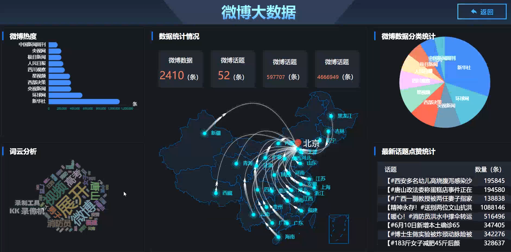

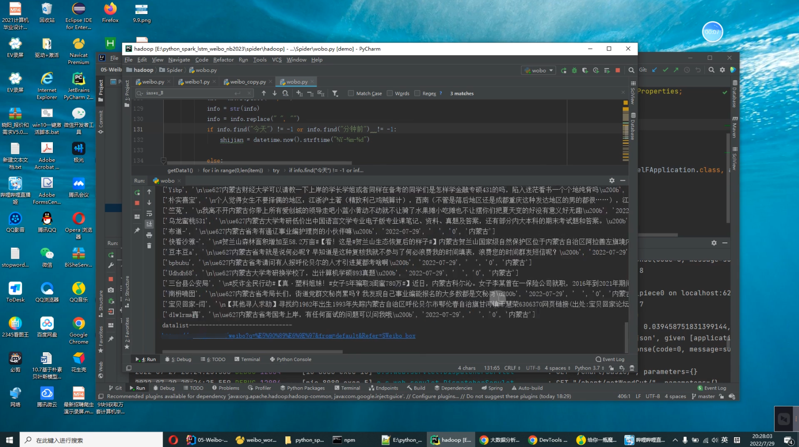

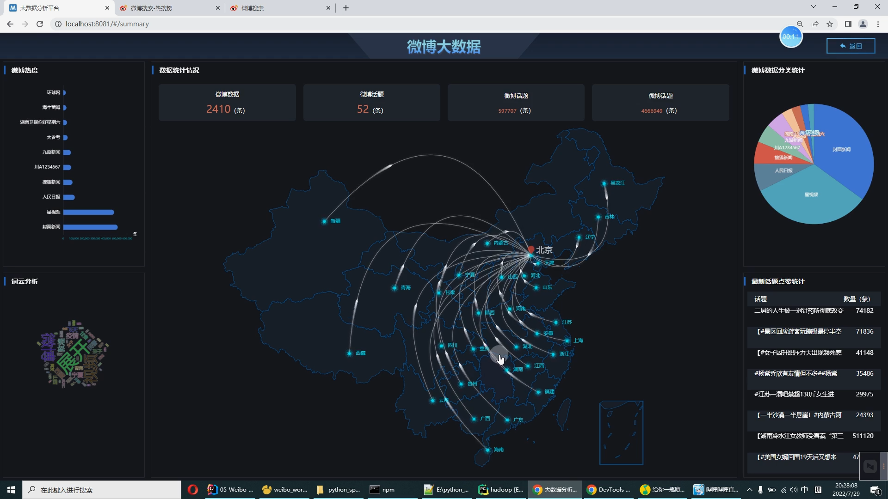

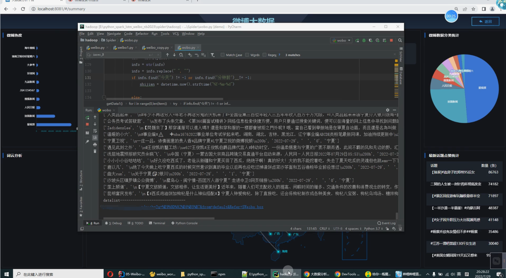

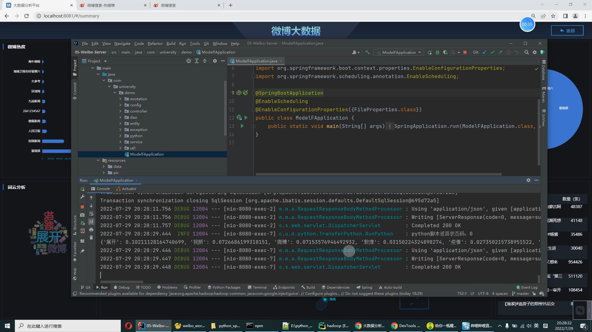

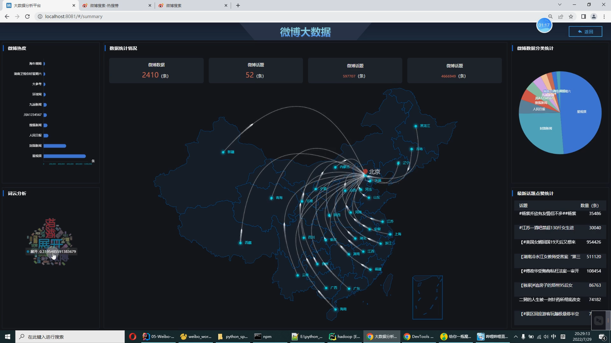

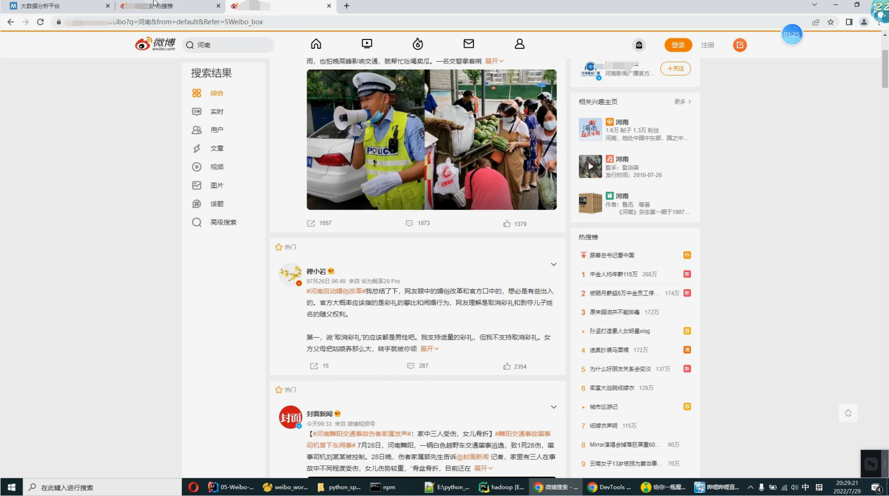

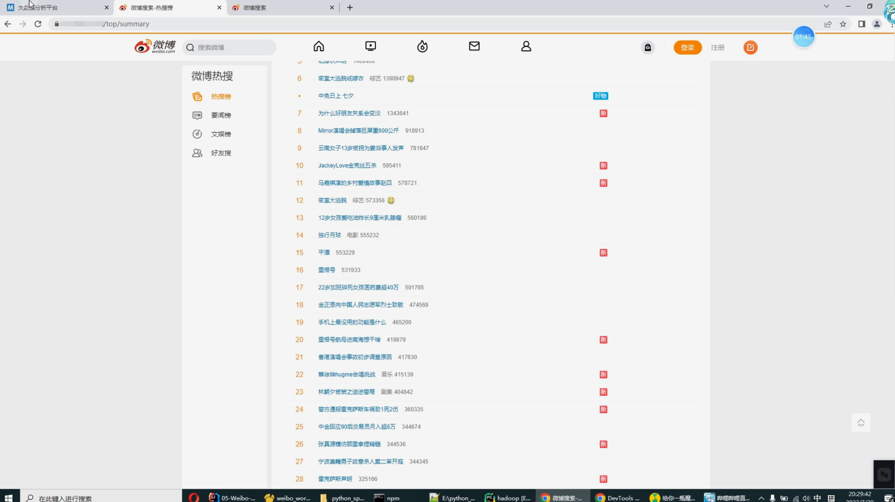

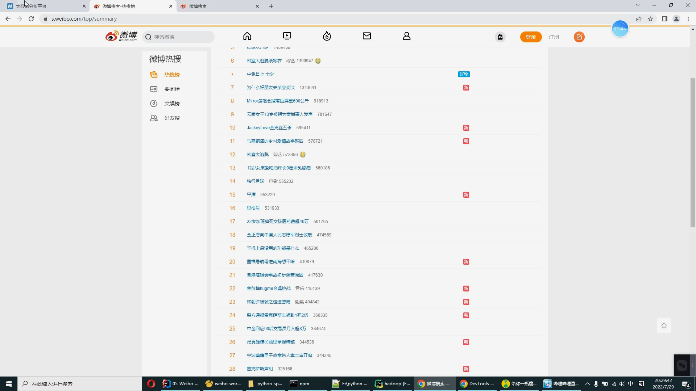

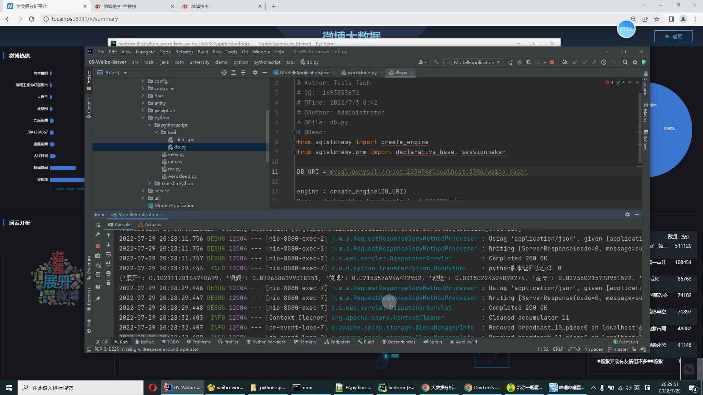

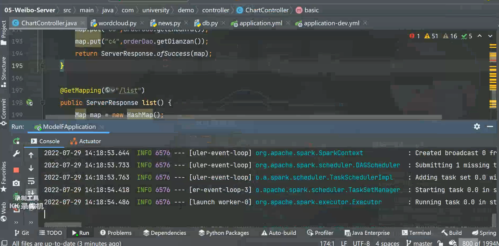

# 运行视频

https://www.bilibili.com/video/BV1BW4y1y7Vb?spm_id_from=333.999.0.0